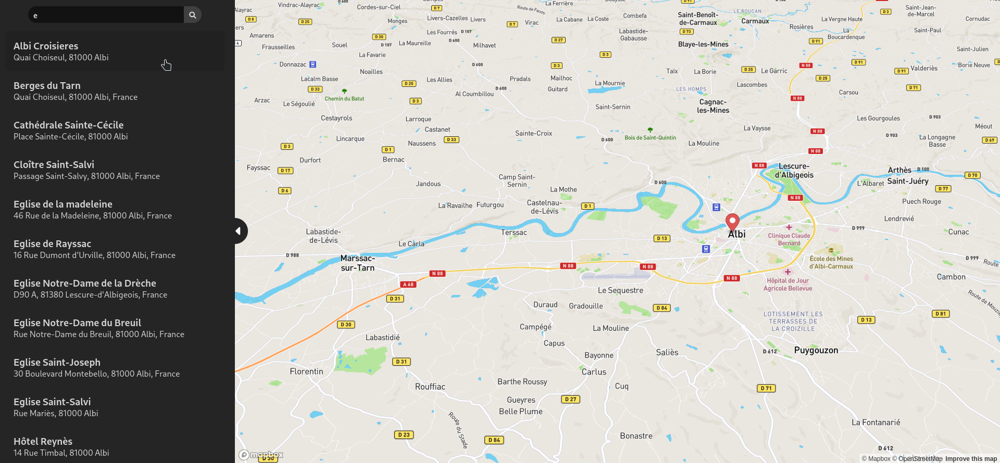
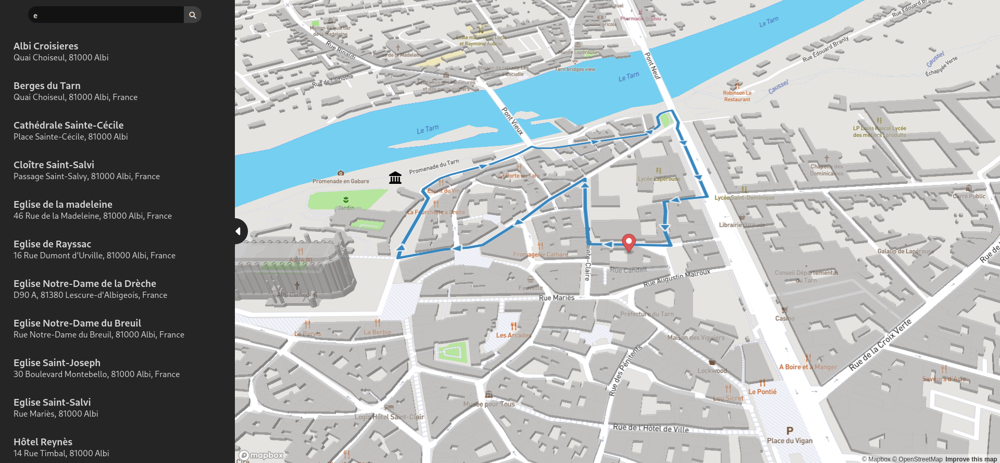

# GeoTourisme
---
## Aperçu du projet



Liste des points clé de la ville



Proposition d'un chemin pour visiter la ville

---
## Description du projet
Ce projet a été réalisé dans le cadre de validation de l'UE technologies du web 4 de L'INU Champollion.

3 étudiants en informatique ont contribué à la réalisation du projet :

- Rodriguez Vincent
- Chablaoui Hamza
- Auberval Florian
 
Le client a été construit avec React, TypeScript ainsi qu'avec l'API MapBox et le serveur est un programme python utilisant Flask Restful, avec une base de données SQLite.

---
## Méthode d'installation
> #### Dans le dossier client:
Ajouter un fichier *.env.local* contenant le token de mapbox
```REACT_APP_MAPBOX_TOKEN=<id_token>```.

Puis faire la commande ```npm install && npm run build``` pour construire le projet.

Et enfin lancer le client avec ```npm start```.

> #### Dans le dossier serveur:
Ajouter un fichier *bdd.py* contenant les logins d'une base de données SQLite.

Le fichier doit être formaté comme suit:
```
ip = 'mon_ip'
user = 'mon_utilisateur'
password = 'mon_mot_de_passe'
database = 'nom_de_la_base_de_données'
```
Puis lancer le serveur Python avec ```python3 main.py```. 

---
